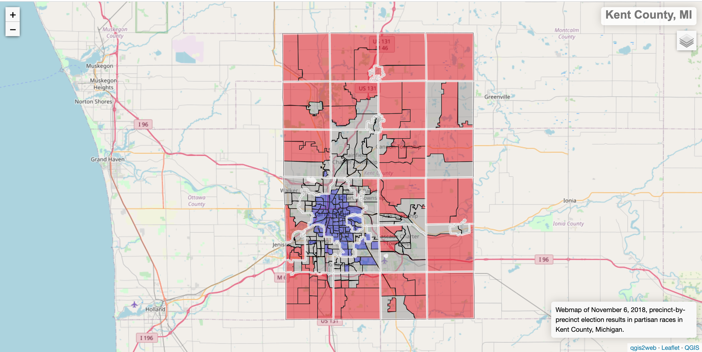
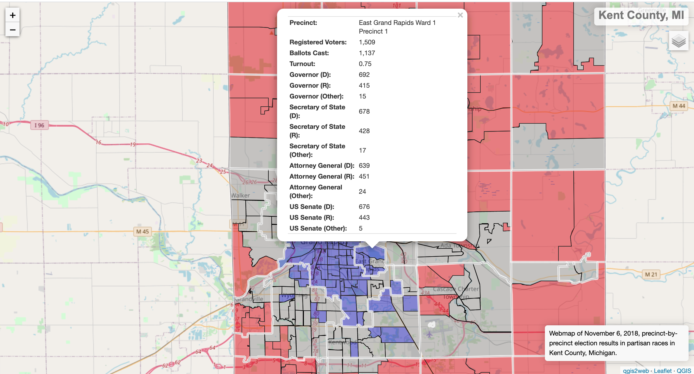

# Kent County Election Results, 2018 General Election
Website: https://sethbilliau.github.io/kentcountyvotes/#12/42.9410/-85.6649
QGIS webmap of November 6, 2018, precinct-by-precinct election results in partisan races in Kent County, Michigan.

This app helps identify precincts more susceptible to down-ballot roll off by noting the differences in vote totals for races at the top of the ballot (ex. Governor) versus races at the bottom of the ballot (ex. County Commission).

In general, Democrats tended to lose votes down ballot while Republicans gained votes. These small margins can mean the difference between winning and losing in local elections like County Commission. 

Main screen: 

Fields Displayed: 

